# 🛒 Online Market Store

A **microservices-based online marketplace** built using **Java 17** and **Spring Boot**.  
The system is designed with scalability and modularity in mind, where each service is independently deployable and communicates via REST APIs.

---

## 📐 Architecture



The application follows a **Microservices Architecture**, where each service owns its data and operates independently.

### 🔹 Services Overview

| Service | Database | Description |
|--------|----------|-------------|
| **Product Service** | MongoDB | Handles product catalog (CRUD operations) |
| **Order Service** | MySQL | Manages order creation and processing |

---

## 🛠️ Tech Stack

### ⚙️ Backend
- **Java 17**
- **Spring Boot 4.0.5**
- **Spring Data JPA**
- **Spring Data MongoDB**

### 🗄️ Databases
- **MongoDB** → Product Service  
- **MySQL** → Order Service  

### 🔧 Tools & Libraries
- **Maven** (with Maven Wrapper)
- **Lombok**
- **Testcontainers**
- **JUnit 5**

---

## 📁 Project Structure

```
online-Market-Store/
├── product-services/          # Product microservice
│   └── src/main/java/com/microservice/product_services/
│       ├── controller/        # REST APIs
│       ├── dto/               # Data Transfer Objects
│       ├── model/             # MongoDB documents
│       ├── repository/        # MongoDB repositories
│       ├── service/           # Business logic
│       └── ProductServicesApplication.java
│
├── order_service/             # Order microservice
│   └── src/main/java/com/microservice/order_service/
│       ├── controller/        # REST APIs
│       ├── dto/               # Data Transfer Objects
│       ├── model/             # JPA entities
│       ├── repository/        # JPA repositories
│       ├── service/           # Business logic
│       └── OrderServiceApplication.java
│
└── order_service_flow.svg     # System architecture diagram
```

---

## 🚀 Getting Started

### 📌 Prerequisites

Make sure you have the following installed:

- Java 17+
- Maven (or use the included wrapper)
- MongoDB (running locally or via Docker)
- MySQL (running locally or via Docker)
- Docker (optional, for testing)

---

### ▶️ Run Product Service

```bash
cd product-services
./mvnw spring-boot:run
```

Runs on: `http://localhost:8080`

---

### ▶️ Run Order Service

```bash
cd order_service
./mvnw spring-boot:run
```

Runs on: `http://localhost:8081` *(or configured port)*

---

## 🧪 Testing

Integration tests are powered by **Testcontainers**, which automatically spins up real database instances in Docker.

### Run Tests

```bash
# Product Service
cd product-services
./mvnw test

# Order Service
cd order_service
./mvnw test
```

---

## 🔗 API Communication

- Services communicate via **REST APIs**
- Order Service interacts with Product Service to validate product availability *(if implemented)*

---

## 📌 Future Improvements

- 🔐 API Gateway (Spring Cloud Gateway)
- 🧭 Service Discovery (Eureka)
- ⚡ Resilience (Resilience4j / Circuit Breaker)
- 📦 Kafka-based event-driven communication
- 🧑‍💼 Admin dashboard
- 💳 Payment integration

---

## 🤝 Contributing

Contributions are welcome!

1. Fork the repository  
2. Create a feature branch  
3. Commit your changes  
4. Open a Pull Request  

---

## 📄 License

This project is open-source and intended for **learning and educational purposes**.

---

## 👨‍💻 Author

**Mahmod Abou Zithar**

- GitHub: https://github.com/abou-zithar

---

## ⭐ Support

If you found this project helpful, consider giving it a ⭐ on GitHub!
